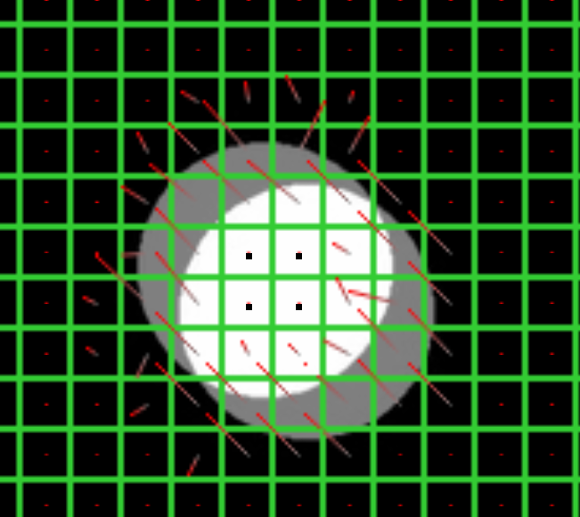
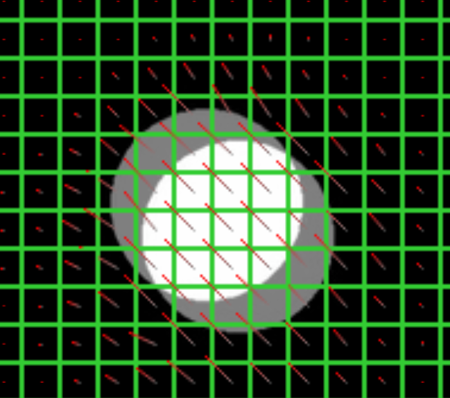
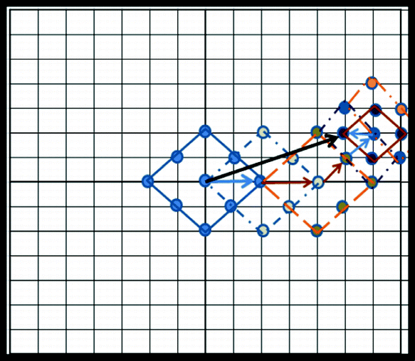
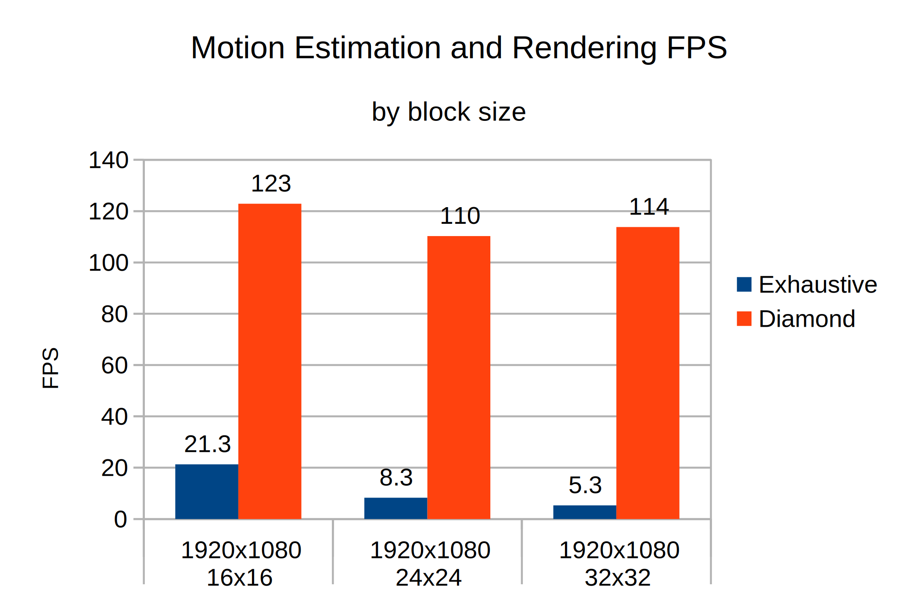
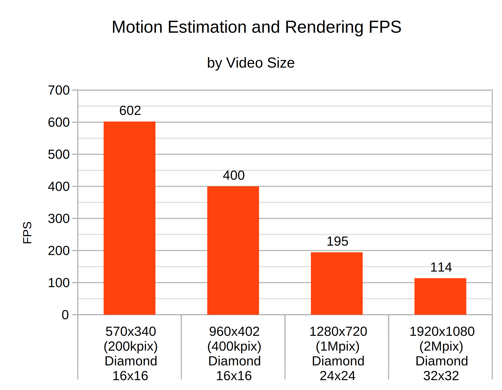

## Example

<video data-src="media/ball-small.mp4" loop></video>

## Motivation / Prior Art

-   Why? 60 > 24. Panning in movies looks horrible
-   TV features like Motion Boost / TruMotion (controversial)
-   Smooth Video Project ([svp-team.com](svp-team.com))
-   Video Compression
-   Slow Motion in Smartphones, Adobe Premiere etc.

## Overview

1. Motion Estimation via Block Matching:

    Find most similar 16x16 pixel block close to current block

2. Render Frame

    Move by motion vectors and blend blocks

. . .

All videos are screen recordings (real time!)

## Motion Estimation

For every OpenCL local 2D group:

-   Load a 3x3 grid of 16x16 blocks of both images into local memory
-   Compute the SAD for moving the center block to every possible offset <small>(Sum of absolute differences)</small>
-   Bias for e.g. consistency with neighbourhood
-   Do everything a second time for backwards motion

##

{width=70% .noborder}

## {transition=none}

{width=70% .noborder}

## {transition=none}

{width=70% .noborder}

## Motion Estimation Example

:::::::::::::: {.columns}
::: {.column width="50%"}
{width=90%}
:::
::: {.column width="50%" .fragment}
{width=90%}
:::
::::::::::::::

## Motion Vectors

<video data-src="media/mvecs-small.mp4" loop></video>

## Diamond Block Search

Exhaustive search is slow. Lots of research on search patterns.

{width=40%}

## Frame Rendering

1. Shift Motion vectors by themselves by some factor depending on time
2. For every output pixel, read input pixel shifted by negative motion vector \* deltatime
3. Do this four times (img1 forward, img1 backward, img2 forward, img2 backward)
4. Blend pixels depending on deltatime and visibility

## Shift Forward Motion Vectors

<video data-src="media/shifted-mvecs-small.mp4" loop></video>

## Rendered

<video data-src="media/mvecs-render-small.mp4" loop></video>

## Full Debug Output

<video data-src="media/2020-01-07-debug1-small.mp4" loop></video>

## Movie Example 1 (slowed 50%) {.nospace}

<video data-src="media/movie-example1-small.mp4" loop></video>

## Movie Example 2 (slowed 50%) {.nospace}

<video data-src="media/movie-example2-small.mp4" loop></video>

## Benchmark

{width=60%}

##

{width=70%}

##

{width=70%}

## Link to Code

<https://github.com/phiresky/opencl-motion-interpolation>
